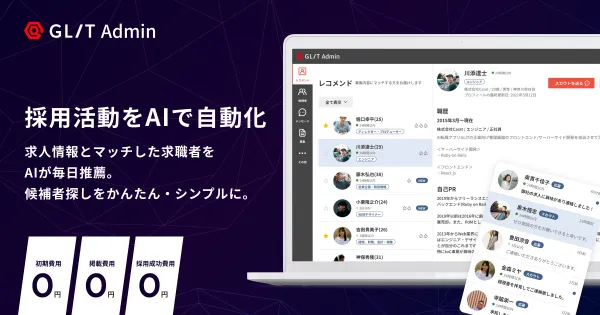
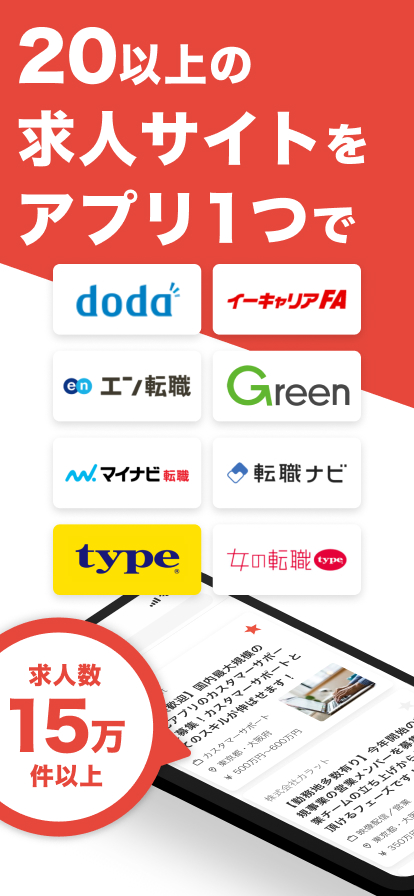
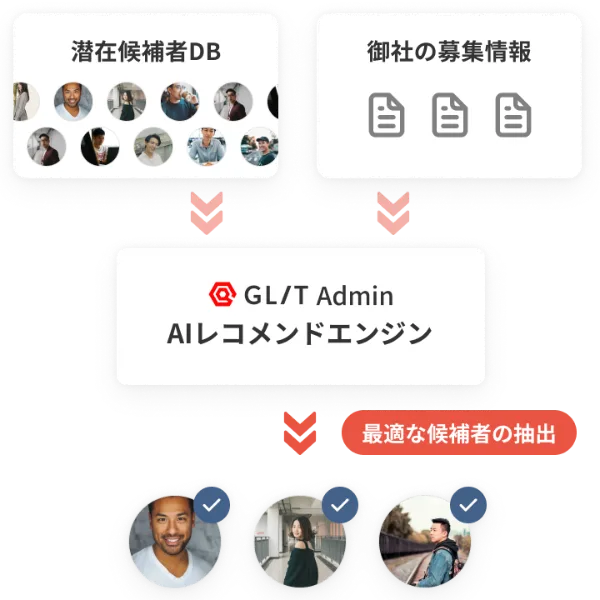
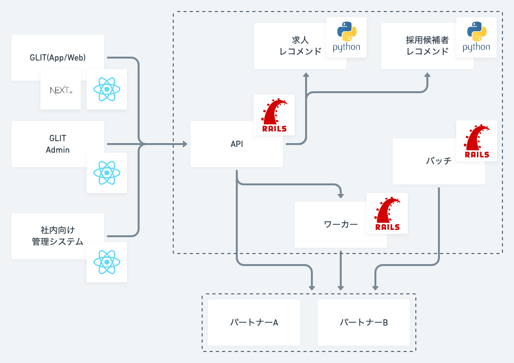
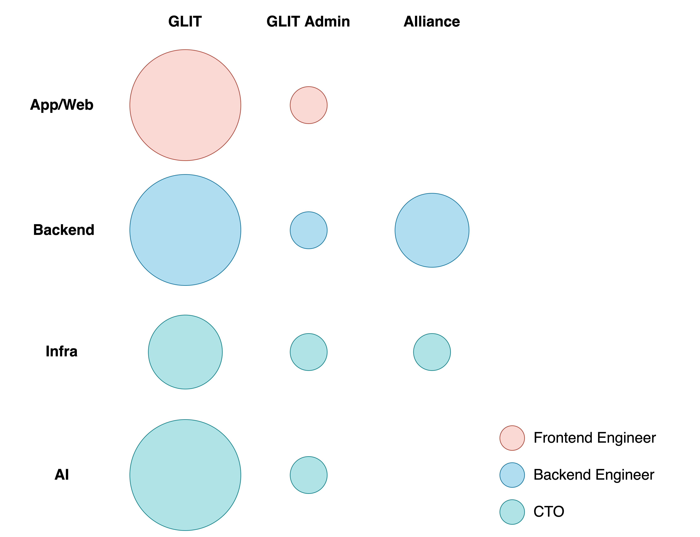

## 株式会社Carat会社紹介資料

for Engineers

2022.01 updated

<!--
Also supports multiline.
We bet these comments would help your presentation...
-->

---

### Company

- 2016年12月にCEO松本・CTO斎藤によって創業
- 正社員は4名、業務委託の方を入れると10名ほど
  - うち、エンジニア・デザイナーはCTO含めて5名
- 本社は東京都渋谷区代々木にありますが、全員リモート勤務
- 詳しくはこちら↓ https://caratinc.notion.site/Carat-3fdf975a11c24bc98e5a0274c0c05b31

---

### About CTO

- 斎藤陽介( @saitoxu )
- 1989年生まれ東京在住
- 2014年京都大学大学院修了
- 新卒で株式会社SHIFTに入社し、 業務用Webアプリケーションの開発に従事
- 2016年12月にCEO松本と株式会社Caratを共同創業
- 2021年4月に京都大学大学院情報学研究科博士課程に入学

---

### Services

レコメンド型転職サービスGLIT(グリット)
AIを活用した 企業向け採用ソリューションGLIT Admin

---

### GLIT

- https://glit.io
- 20以上の求人サイトの求人情報を掲載した転職サービス
- 求人情報のアグリゲーションとレコメンデーションが特徴
- iOS/Android/Webの3プラットフォームで展開

---

### GLIT Admin

- https://lp.glit.io/enterprise
- 機械学習を活用した採用候補者のレコメンデーションが特徴

---

### Tech Stack & Tools

- GLIT
  - iOS/Android: React Native(TypeScript 90%), Firebase
  - Web: Next.js(TypeScript 100%)
- GLIT Admin
  - Web: Next.js(TypeScript 100%)
- API: Ruby on Rails
- 推薦API: FastAPI, Amazon SageMaker
- インフラ: AWS, GCP(BigQuery)

---

### Tech Stack & Tools

- ソースコード管理: GitHub
- チケット管理: JIRA
- ドキュメンテーション・仕様管理: Notion
- デザイン: Figma
- コミュニケーション: Slack, Zoom
- CI/CD: Bitrise, CircleCI
- モニタリング: Datadog, Sentry

---

### Architecture

- 現在は2つのサービスで1つのAPIを共用するモノリスな構成です
- レコメンド機能はPrivate APIとして提供しています

---

<!-- ### Team

- 1チームですべてのサービスの開発・運営を行っています

--- -->

### Development Flow

- PdMからチケットがアサインされます
- コードレビューはCTO + 同じ職種のエンジニアが実施しています
- ソフトウェアテスト会社出身のメンバーが多いのでQAが充実しています
- 週次のプロダクトミーティングでは今後のタスクに関するディスカッションや振り返りなどを行っています

---

### Ticket Examples

- フロントエンド
  - アプリストアへのレビュー機能追加
  - おすすめ画面から直接求人応募できるような導線追加
  - etc.
- バックエンド
  - 雇用形態で検索できるように求人検索APIを改修
  - 求人の重複判定バッチ開発
  - etc.

---

### Challenges

1. 膨大な求人数の活用 パートナー企業から提供を受けている百万件近くの求人を、ニアリアルタイムでユーザーに提供する必要があります。単純に求人をストアするだけでなく、データの構造化や特徴量の抽出など数々のチャレンジがあります。

2. 様々なパートナー企業とのシステム連携 今後更に連携パートナーを増やしていけるよう、システム連携の仕組み化・抽象化を念頭に置きつつアーキテクチャの設計や開発業務を推進する必要があります。

---

### Selling Points

1. 大きな裁量権 まだ小さなチームのため、大きな裁量権を持ってサービス開発に携わることができます。

2. ビジネスサイドの開発への理解度 CEOやPdMのエンジニアリングへの理解度が高いです。ビジネスサイドとの意思疎通が難しいなどのストレスが少なく、価値創造に集中できる環境だと思います。

