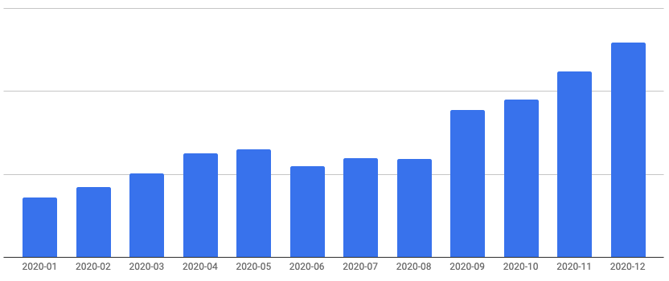

## 株式会社Carat 会社紹介資料

エンジニア向け

<!--
Also supports multiline.
We bet these comments would help your presentation...
-->

---

### 目次

1. 会社概要
1. CTO紹介
1. 提供しているサービス
1. 技術スタックと開発ツール
1. アーキテクチャ
1. チーム
1. 開発フロー
1. 課題
1. 価値観
1. セールスポイント

---

### 会社概要

* 2016年12月にCEO松本・CTO斎藤によって創業
* 正社員は4名、業務委託の方を入れると10名ほど
  * うち、エンジニア・デザイナーはCTO含めて3名
* 本社は東京都渋谷区代々木にありますが、全員リモート勤務
* 詳しくはこちら → https://www.notion.so/Carat-3fdf975a11c24bc98e5a0274c0c05b31

#### →コロナ禍で体制を縮小しましたが、安定したビジネス基盤ができつつあるので改めて採用強化中

---

### CTO紹介

* 斎藤陽介( @saitoxu )
* 1989年生まれ東京在住
* 2014年京都大学大学院修了
* 新卒で株式会社SHIFTに入社し、 業務用Webアプリケーションの開発に従事
* 2016年12月にCEO松本と株式会社Caratを共同創業
* 2021年4月から京都大学大学院情報学研究科博士課程に進学予定

---

### 提供しているサービス

* GLIT(グリット) https://glit.io
* 20以上の求人サイトの求人情報を 掲載した転職サービス
* 求人情報のアグリゲーション → レコメンデーションが特徴
* iOS/Android/Webの 3プラットフォームで展開

---

### 提供しているサービス

* MAUは堅調に伸長中

---

### 提供しているサービス

* GLIT Admin https://glit.io/enterprise
* 企業/エージェント向けの採用サービス
* 採用候補者のレコメンデーション が特徴

---

### 技術スタックと開発ツール

* GLIT
  * iOS/Android: React Native(TypeScript約90%), Firebase
  * Web: Next.js(TypeScript 100%)
* GLIT Admin
  * Web: React(TypeScript約40%)
* API: Ruby on Rails
* インフラ: AWS, GCP(BigQuery)

---

### 技術スタックと開発ツール

* ソースコード管理: GitHub
* チケット管理: JIRA
* ドキュメンテーション・仕様管理: Confluence
* デザイン: Figma
* コミュニケーション: Slack, Zoom
* CI/CD: Bitrise, CircleCI
* 監視: Datadog

---

### アーキテクチャ

---

### チーム

* 主にプロダクト開発に関わっているのはCEO, CTO, PdM(COO), エンジニア2名(業務委託)
* エンジニアの方は1人はデザイナー兼フロントエンドエンジニア、もう1人はフロントエンド専任
* 現在はフロントエンドは業務委託の方々に、CTOがバックエンドなどその他全般を担当しています

---

### 開発フロー

* 週次のプロダクトミーティングでアサインなどを決めます(現在は毎週金曜)
* コードレビューはCTOが担当しています
* ソフトウェアテスト会社出身が多いのでQAは比較的厚めです

---

### 課題

* 2021年4月でGLITはサービスインして5年目に入るため、少しずつ負債も目立つようになってきました
* 特にAPIはモノリシックなRuby on Railsアプリケーションとして開発されているため、何かしら方針を立てリファクタリングを進め、次の5年に耐えうるようなアーキテクチャにしたいと考えています

---

### 価値観

1. 最小人数で最大限の価値を ソフトウェアアーキテクチャの目的は求められるシステムを構築・保守するために必要な人材を最小限に抑えることである - Clean Architecture

2. 職人のこだわりと現実のバランス QCDを守りつつも、1ピクセルのこだわりやメソッド・変数の命名などをないがしろにせずにしたいと思っています。

---

### セールスポイント

1. 大きな裁量権 まだ小さなチームのため、大きな裁量権を持ってサービス開発に携わることができます。

2. ビジネスサイドの開発への理解度 CEOやPdMのエンジニアリングへの理解度が高いです。ビジネスサイドとの意思疎通が難しいなどのストレスが少なく、働きやすい環境だと思います。

