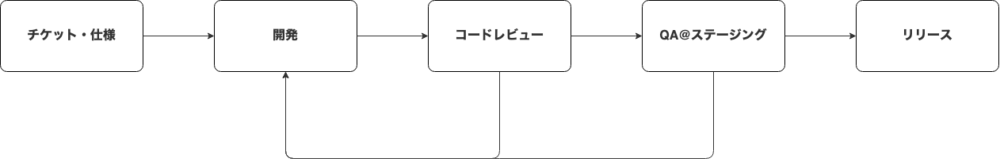

## 株式会社Carat会社紹介資料

for Engineers

2022.06 updated

<!--
Also supports multiline.
We bet these comments would help your presentation...
-->

---

### Company

- 2016年12月にCEO松本・CTO斎藤によって創業
- 正社員は4名、業務委託の方を入れると10名ほど．うち，エンジニア・デザイナーはCTO含めて5名
- 本社は東京都渋谷区代々木にありますが，全員リモート勤務
- 詳しくはこちら👉 https://caratinc.notion.site/Carat-3fdf975a11c24bc98e5a0274c0c05b31

---

### CTO

- 斎藤陽介( @saitoxu )
- 1989年生まれ東京在住
- 2014年3月京都大学大学院修了
- 2014年4月に株式会社SHIFTに入社．業務用Webアプリケーションの開発に従事
- 2016年12月にCEO松本と株式会社Caratを共同創業
- 2021年4月に京都大学大学院情報学研究科博士課程に入学

---

### Services

- レコメンド型転職サービスGLIT(グリット)
- 求人アプリ垂直立ち上げサービスGLIT Platform

---

### GLIT

- https://glit.io
- 30サイト・50万件を超える求人情報を掲載した転職サービス
- 求人情報のアグリゲーションとレコメンデーションが特徴
- iOS/Android/Webの3プラットフォームで展開

---

### GLIT Platform

- https://lp.glit.io/platform
- GLITで培ったノウハウを活かして，求人アプリの立ち上げ〜提供をサポート
- 初期開発からグロースまで伴走し，顧客の事業成長にコミット

---

### Tech Stack

- iOS/Android: React Native(TypeScript 95%), Firebase
- Web: Next.js(TypeScript 100%)
- API: Ruby on Rails
- 検索: Elasticsearch
- 推薦API: FastAPI
- インフラ: AWS, GCP(BigQuery)

---

### Tools

- ソースコード管理: GitHub
- チケット管理: JIRA
- ドキュメンテーション・仕様管理: Notion
- デザイン: Figma
- コミュニケーション: Slack, Zoom
- CI/CD: Bitrise, CircleCI
- モニタリング: Datadog, Sentry

---

### Development Flow

- PdMからチケットがアサインされます
- コードレビューはCTO + 同じ職種のエンジニアが実施しています
- ソフトウェアテスト会社出身のメンバーが多いのでQAが充実しています
- 週次のスプリントミーティングではタスクのアサインやスケジュールの確認などを行っています

---

### Ticket Examples

- フロントエンド
  - アプリストアへのレビュー機能追加
  - おすすめ画面から直接求人応募できるような導線追加
  - etc.
- バックエンド
  - 雇用形態で検索できるように求人検索APIを改修
  - 求人の重複判定バッチ開発
  - etc.

---

### Challenges

1. 膨大な求人数の活用 パートナー企業から提供を受けている百万件近くの求人を，ニアリアルタイムでユーザーに提供する必要があります．単純に求人をストアするだけでなく，データの構造化や特徴量の抽出など数々のチャレンジがあります．

2. 様々なパートナー企業とのシステム連携 今後更に連携パートナーを増やしていけるよう，システム連携の仕組み化・抽象化を念頭に置きつつアーキテクチャの設計や開発業務を推進する必要があります．

---

### Selling Points

1. 大きな裁量権 まだ小さなチームのため，大きな裁量権を持ってサービス開発に携わることができます．

2. ビジネスサイドの開発への理解度 CEOやPdMのエンジニアリングへの理解度が高いです．ビジネスサイドとの意思疎通が難しいなどのストレスが少なく，価値創造に集中できる環境だと思います．

